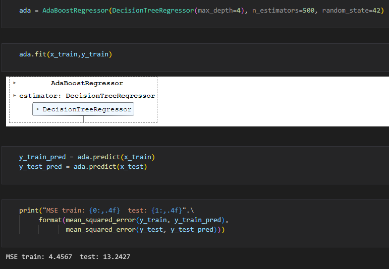
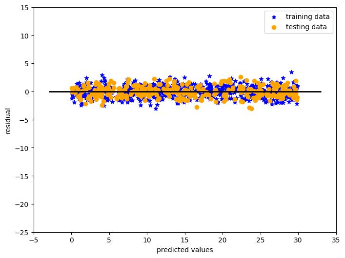
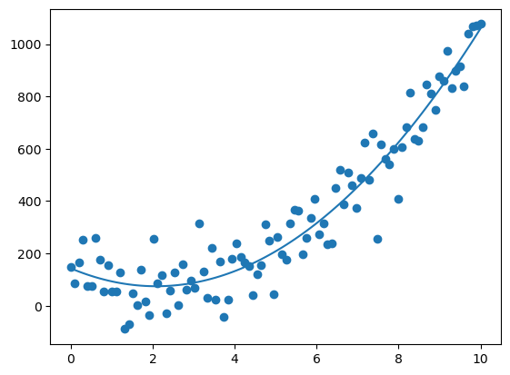
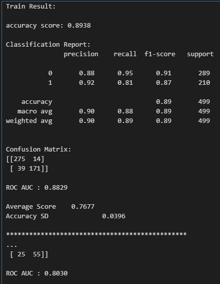
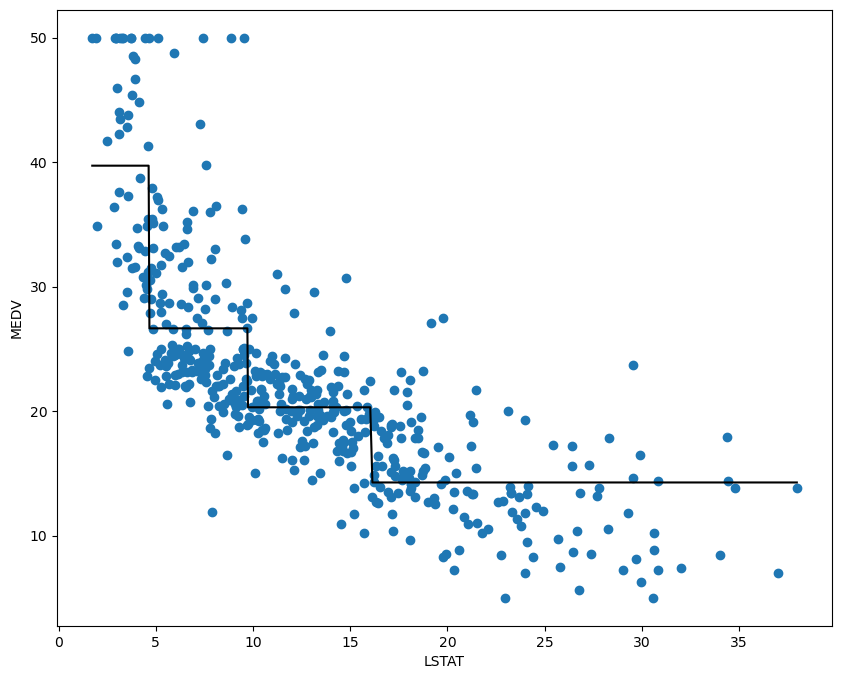

# 🤖 ML Basic Models Collection

Welcome to this repository containing a suite of foundational **machine learning models** implemented using Python and scikit-learn. This collection is aimed at helping you understand, implement, and evaluate core ML algorithms — especially those commonly encountered in real-world applications and academic learning.

---

## 🧠 Introduction to Machine Learning

**Machine Learning (ML)** is a subset of artificial intelligence that allows computers to learn patterns from data and make decisions or predictions without being explicitly programmed. It is broadly categorized into:

- **Supervised Learning** – where the model learns from labeled data.
- **Unsupervised Learning** – where the model finds structure in unlabeled data.
- **Reinforcement Learning** – where the model learns by interacting with an environment and receiving rewards or penalties.

This repository focuses on **supervised learning**, showcasing both **regression** and **classification** models, along with techniques to evaluate their performance.

---

## 📁 Folder Overview

This repository contains the following Jupyter Notebooks:

- `linear_regression.ipynb`:  
  Implements simple linear regression with visualization and basic evaluation metrics (mean_squared_error, r2_score).

- `multiple_regression.ipynb`:  
  Demonstrates multivariate regression with multiple input features and feature scaling on boston housing dataset.

- `logistic_reg.ipynb`:  
  Binary classification using logistic regression.

- `Classification_models.ipynb`:  

  Contains: following models applied on `titanic` dataset
  - **Decision Tree Classifier**
  - **Random Forest Classifier**
  - **Bagging Classifier**  
  - **Grid Search**
  - **Extra Tree Classifier**
  - **AdaBoost**
  - **Gradient Boosting**

  Includes model training and evaluation using:
  - **Confusion Matrix**
  - **Accuracy Score**
  - **ROC AUC**
  - **Train/Test Split**
  - **Classification Report**

- `nonlinear.ipynb`:  
  Explores non-linear models, decision boundaries, and visualizations for curved relationships.
  Contains: models like `DecisionTree`, `Random Forest`, `AdaBoost` applied on `Boston housing`. Also extracted feature importance.

- `polynomial.ipynb`:  
  Demonstrates polynomial regression for capturing non-linear trends in data using different degrees.

---

## 🛠️ Requirements

Install required Python packages before running the notebooks:

```bash
pip install numpy pandas matplotlib seaborn scikit-learn
```

---

## 🚀 Getting Started

1. Clone or download this repository.
2. Open any `.ipynb` notebook using [Jupyter Notebook](https://jupyter.org) or [VS Code](https://code.visualstudio.com).
3. Run the cells in sequence to explore how each ML model works.

---

## 🌟Previews


Here’s a sneak peek into some of the plots and outputs generated by the scripts:












---

## 🔍 What You'll Learn

- Fundamental regression and classification techniques in ML
- Evaluation metrics:
  - Confusion Matrix
  - Accuracy Score
  - Classification Report
  - mean_squared_error
  - r2_score
- Concept of underfitting, overfitting, and model validation
- Visualizing model performance and decision boundaries

---

## 📌 Notes

- The datasets used are either built-in (like Iris, Boston) or synthetically generated using `numpy` and `sklearn.datasets`.
- These notebooks were created as part of my ML learning journey from Udemy and personal practice.

---

## 📜 License

This repository is licensed under the [MIT License](LICENSE).  
Feel free to fork, modify, or build upon it for your own learning or projects.

---

Happy Coding & Learning! 🚀📊
